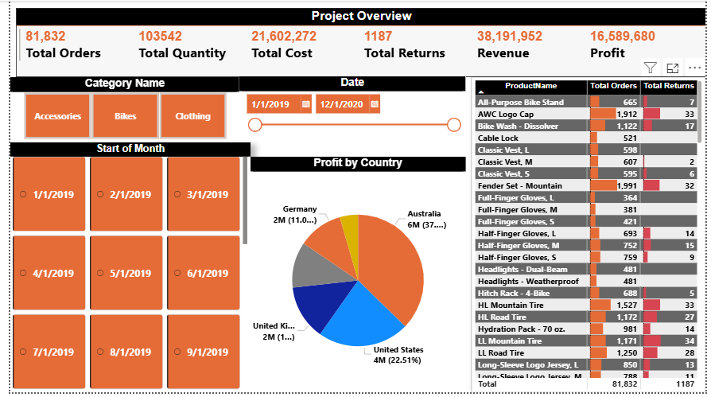
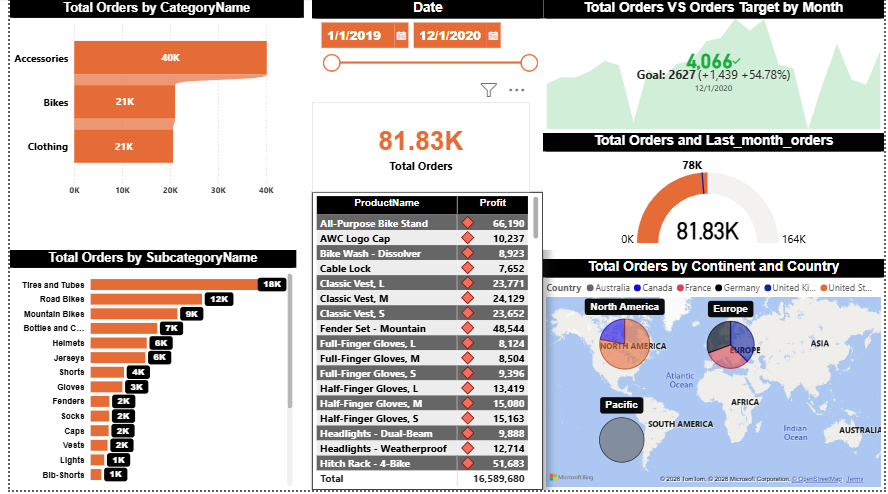
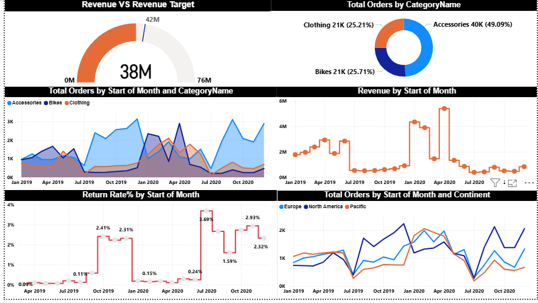

# Sales & Operations Performance Dashboard

## **Project Overview**
لوحة بيانات تفاعلية وشاملة تم بناؤها باستخدام **Power BI** لتحليل أداء المبيعات والعمليات، تهدف إلى تقديم رؤى دقيقة حول الإيرادات، الأرباح، ونسبة المرتجعات.

---

## **Dashboard Preview**

---

## **Technical Skills Demonstrated**
* **Data Modeling:** ربط جداول المبيعات، المنتجات، والجغرافيا لبناء نموذج بيانات متكامل.
* **DAX (Data Analysis Expressions):** إنشاء مقاييس متقدمة لحساب المقارنات بين الأداء الفعلي والمستهدف (Target vs. Actual).
* **Data Visualization:** استخدام الرسوم البيانية الأنسب (Gauges, Area Charts, Map Visuals).
* **Power Query:** تنظيف ومعالجة البيانات لضمان دقة التقارير.
